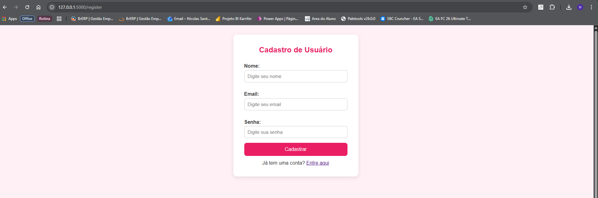
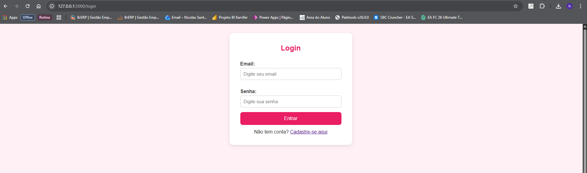
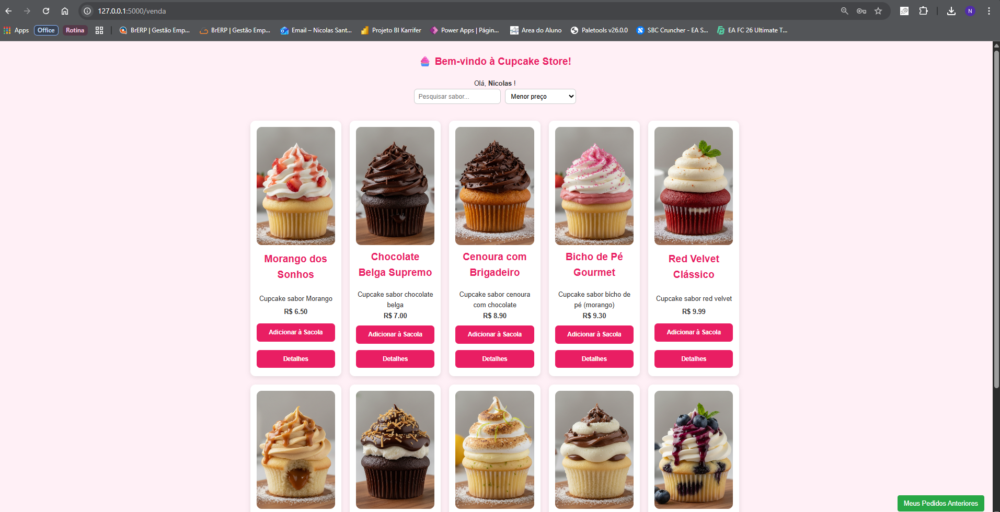
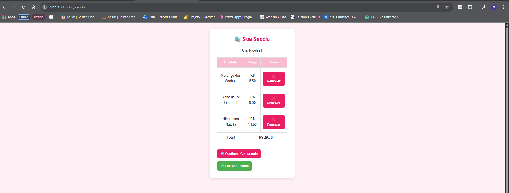
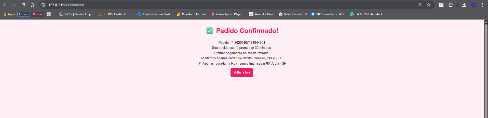
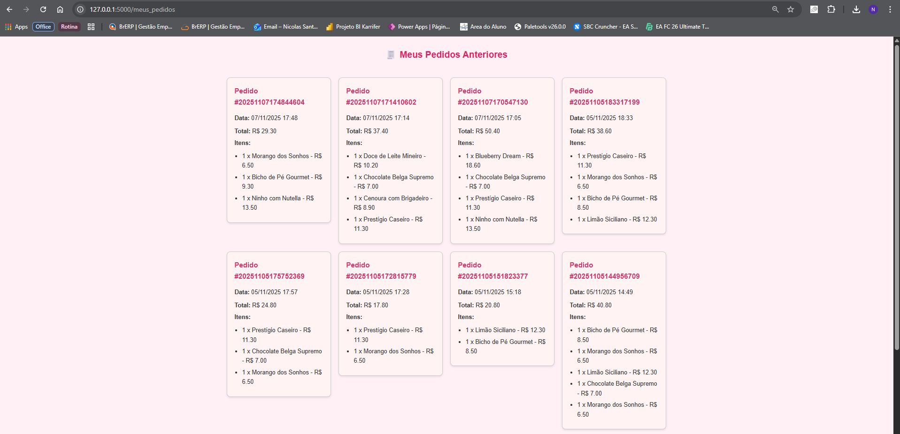
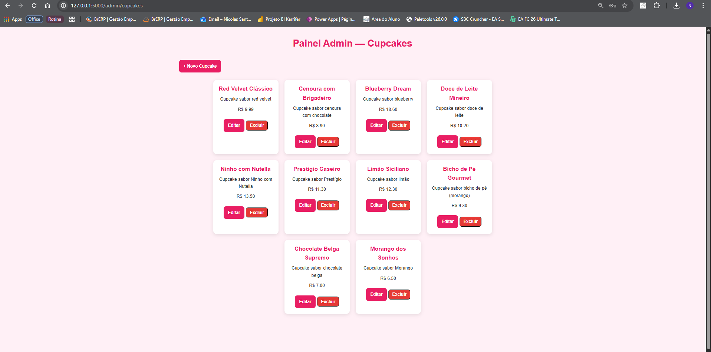
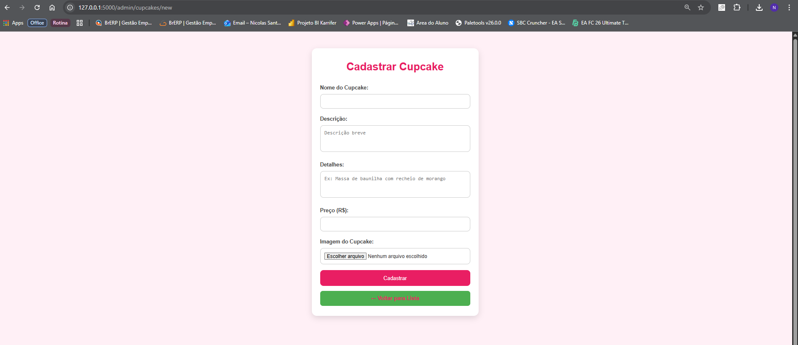

#🧁 CupcakeStore

Um sistema web desenvolvido em Python para gerenciar vendas de cupcakes.
O projeto permite que usuários se cadastrem, façam login, visualizem produtos disponíveis e realizem pedidos.
Há também uma área administrativa para gerenciar os cupcakes e acompanhar os pedidos feitos anteriormente.

🚀 Funcionalidades principais:

🧍‍♂️ Cadastro e login de usuários

🛒 Sistema de sacola (adicionar e remover cupcakes)

🍰 Visualização dos cupcakes disponíveis

💳 Tela de venda com resumo do pedido

🧾 Confirmação de compra

🔐 Área administrativa para cadastro e controle de cupcakes

🧩 Estrutura do Projeto:

CUPCAKESTORE/
│
├── app.py # Arquivo principal do Flask
├── cupcakes.db # Banco de dados SQLite
├── requirements.txt # Dependências do projeto
├── .gitignore
│
├── templates/ # Páginas HTML (Frontend)
│ ├── index.html
│ ├── login.html
│ ├── register.html
│ ├── sacola.html
│ ├── venda.html
│ ├── admin_list.html
│ ├── admin_form.html
│ └── ...
│
├── static/ # Arquivos estáticos (CSS, imagens)
│ └── css/
│ └── style.css
│
└── uploads/ # Imagens dos cupcakes

🗄️ Banco de Dados:

O sistema utiliza SQLite3 para armazenar informações.

As principais tabelas incluem:

user → guarda nome, e-mail e senha dos usuários.

cupcakes → armazena nome, sabor, preço e imagem de cada cupcake.

order → registra compras realizadas e associa ao usuário.

O banco já está configurado e é criado automaticamente ao rodar o projeto pela primeira vez.

💡 checar_db.py é um script auxiliar usado apenas para verificar se o banco de dados contém registros de cupcakes. Não é necessário para executar o sistema.

⚙️ Como executar o projeto

Clone este repositório: 
git clone https://github.com/nicsantana06/CupcakeStore.git
cd CupcakeStore

Crie e ative o ambiente virtual: 
python -m venv venv
venv\Scripts\activate  # No Windows

Instale as dependências: 
pip install -r requirements.txt

Execute o servidor: 
python app.py

Acesse no navegador: 
http://localhost:5000

🧠 Padrão de Arquitetura (MVC): 

O projeto segue uma estrutura simplificada do padrão MVC 

Model: cupcakes.db (banco de dados)

View: arquivos HTML na pasta templates

Controller: app.py (responsável por gerenciar rotas e lógica de negócio)

💡 Observação: 

O usuário pode criar seu próprio login diretamente na página de cadastro.

Após logar, poderá acessar a tela de vendas e visualizar todos os cupcakes disponíveis.

Não é necessário configurar o banco manualmente.

🧑‍💻 Tecnologias utilizadas: 

Python 3.x

Flask

SQLite3

HTML / CSS

Jinja2 Templates

📷 Exemplo de interface: 

🏷️ Autor: 
Nicolas Sant’Ana Rodrigues
📧 github.com/nicsantana06
